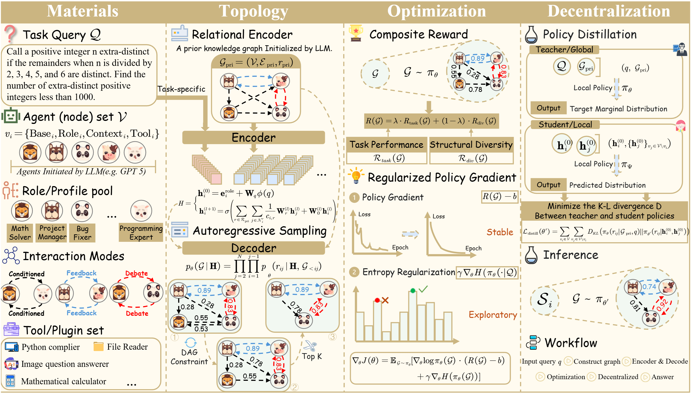

<div align="center">

# 🦠 TopoDIM

**One-shot Topology Generation of Diverse Interaction Modes for Multi-Agent Systems**
[](https://www.python.org/downloads/)



</div>

---

## 📖 Overview

TopoDIM learns and searches **multi-agent interaction topologies** using an **R-GCN-based graph-generation policy**, then evaluates the resulting execution graphs on common LLM benchmarks (Math / QA / Code).

## ✨ Features

- 🔗 **R-GCN Policy Network** - Graph neural network for topology generation
- 🤖 **Multi-Agent Orchestration** - Flexible agent interaction patterns
- 📊 **Comprehensive Benchmarks** - Support for GSM8K, MMLU-Pro, HumanEval, AIME, LiveCodeBench
- 🚀 **Local LLM Support** - Seamless integration with Ollama

---

## 🛠️ Installation

### Prerequisites

| Requirement | Version                    |
| ----------- | -------------------------- |
| Python      | 3.10 – 3.12                |
| OS          | Linux / Windows / macOS    |
| GPU         | CUDA-enabled (recommended) |

### Quick Start

**1. Create environment:**

```bash
conda create -n topodim python=3.10 -y
conda activate topodim
```

**2. Install dependencies:**

```bash
pip install -r requirements.txt
```

**3. Install PyTorch & PyG:**

```bash
# Install PyTorch (choose from https://pytorch.org/get-started)
# Install PyG (choose from https://pytorch-geometric.readthedocs.io/)
```

### Core Dependencies

| Package                                  | Purpose                         |
| ---------------------------------------- | ------------------------------- |
| `torch`, `torch-geometric`               | R-GCN policy + graph operations |
| `transformers`, `sentence-transformers`  | Tokenization + embeddings       |
| `ollama`                                 | Local LLM inference backend     |
| `datasets`                               | HuggingFace dataset access      |
| `numpy`, `pandas`, `aiohttp`, `tenacity` | Data + async/retry utilities    |

---

## 🔧 Configuration

### Sentence Embedding Model

The graph policy encodes task/role descriptions using SentenceTransformers (384-dim). A ready-to-use model is bundled under `local/`.

```bash
# Override with custom model
export SENTENCE_EMB_MODEL=local
# or
export SENTENCE_TRANSFORMER_MODEL=sentence-transformers/all-MiniLM-L6-v2
```

### LLM Backend

**Ollama (Default):**

```bash
# 1. Install Ollama: https://ollama.com/
# 2. Pull a model
ollama pull gpt-oss:120b

# 3. Use in experiments
python experiments/run_*.py --llm_name gpt-oss:120b
```

**OpenAI-compatible endpoint (Optional):**

Create `.env` file:
```env
BASE_URL=your_endpoint
API_KEY=your_key
```

---

## 📁 Datasets

Datasets are expected under `datasets_/`:

| Benchmark        | Path                                         | Status         |
| ---------------- | -------------------------------------------- | -------------- |
| GSM8K            | `datasets_/gsm8k/gsm8k.jsonl`                | ✅ Included     |
| HumanEval        | `datasets_/humaneval/humaneval-py.jsonl`     | ✅ Included     |
| AIME (2023–2025) | `datasets_/aime/aime_23_25.jsonl`            | ✅ Included     |
| MMLU-Pro         | `datasets_/MMLU_PRO/data/{val,test}.parquet` | ✅ Included     |
| LiveCodeBench    | `datasets_/LiveCodeBench/...`                | ❌ Manual setup |

<details>
<summary><b>📋 Dataset Formats</b></summary>

| Dataset   | Required Fields                                |
| --------- | ---------------------------------------------- |
| GSM8K     | `question`, `answer`                           |
| HumanEval | `prompt`, `test`, `entry_point`                |
| AIME      | `question`, `answer`                           |
| MMLU-Pro  | `question`, `options`, `answer`/`answer_index` |

**Custom Dataset Integration:**

Implement these interfaces in `experiments/evaluate_mmlu.py`:
- `record_to_input(record) -> {"task": ...}`
- `record_to_target_answer(record) -> str`
- `postprocess_answer(raw_answer) -> str`

</details>

<details>
<summary><b>🔗 LiveCodeBench Setup</b></summary>

```bash
# Clone LiveCodeBench to datasets_/LiveCodeBench/
python -u experiments/run_livecodebench.py \
    --local_lcb_dataset_dir ./datasets_/LiveCodeBench/code_generation_lite
```

</details>

---

## 🚀 Usage

### Quick Run

```bash
# MMLU-Pro
python -u experiments/run_mmlu_pro.py \
    --mode FullConnected \
    --batch_size 4 \
    --agent_nums 5 \
    --num_iterations 10 \
    --num_rounds 1 \
    --diversity_weight 0.8 \
    --optimized_spatial \
    --use_temperature_annealing
```

### Other Benchmarks

<details>
<summary><b>AIME</b></summary>

```bash
python -u experiments/run_aime.py \
    --mode FullConnected \
    --batch_size 4 \
    --agent_nums 5 \
    --num_iterations 10 \
    --num_rounds 1 \
    --diversity_weight 0.8 \
    --optimized_spatial \
    --use_temperature_annealing
```

</details>

<details>
<summary><b>GSM8K</b></summary>

```bash
python -u experiments/run_gsm8k.py \
    --mode FullConnected \
    --batch_size 4 \
    --agent_nums 5 \
    --num_iterations 10 \
    --num_rounds 1 \
    --diversity_weight 0.8 \
    --optimized_spatial \
    --use_temperature_annealing
```

</details>

<details>
<summary><b>HumanEval</b></summary>

```bash
python -u experiments/run_humaneval.py \
    --mode FullConnected \
    --batch_size 4 \
    --agent_nums 5 \
    --num_iterations 10 \
    --num_rounds 1 \
    --diversity_weight 0.8 \
    --optimized_spatial \
    --use_temperature_annealing
```

</details>
